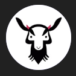

# 🐐 Goatfather Chrome Extension with React 🐐

## Dependencies

NodeJS @ ^16

## Local development

1. `git clone git@github.com:smilyanp/goatfather-chrome.git`

2. `cd goatfather-chrome`

3. `npm i`

4. Build

   `npm run build` // if you just want to run the extension

   `npm run watch` // if you're developing actively

5. In Chrome open `chrome://extensions/`
6. Enable `Developer mode` (top-right)
7. Click `Load unpacked` and select the `/dist` folder in this repository

## Notes

This tool only works for `.tradingview.com/chart` based urls.
